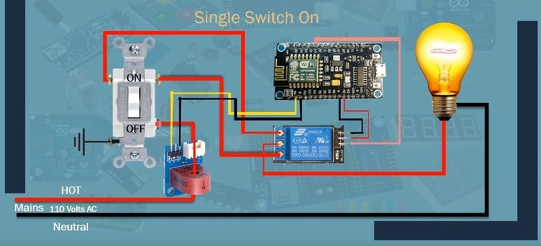

# Relay

The relay module operates at 5V, however, the NodeMCU operates at 3.3V, so a logic level converter is needed to convert from 3.3V to 5V.

## 3-Way switch

In order to be able to still use the lamp in case the Node dies, a physical switch is needed to control the light as usual. The connection diagram is shown as follows:

___

## References

* [Logic level shifter guide](https://learn.sparkfun.com/tutorials/bi-directional-logic-level-converter-hookup-guide?_ga=2.145272756.1689556529.1547139377-1525668908.1546103559)